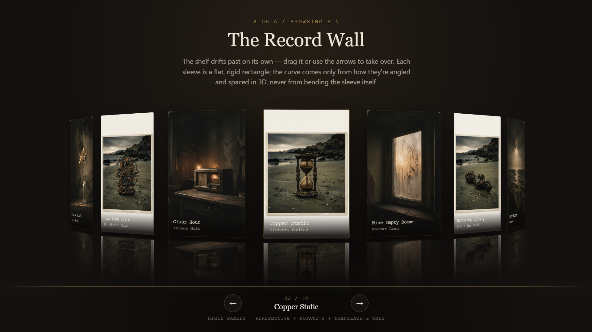

<div align="center">

# 01 — Social Media Flip Card

### Interactive Social Media Cards

A clean and interactive social media card component  
built with HTML, CSS, and JavaScript.

</div>

---

## Preview

<p align="center">
  
</p>

---

## Built With

- HTML5
- CSS3
- JavaScript
- Font Awesome

---

## Getting Started

Follow the steps below to use this project on your computer.

### 1. Download the Project

Click the green **Code** button at the top of this repository.

Select:

```text
Download ZIP
```

Extract the ZIP file after the download is complete.

### 2. Open the Project

Open the extracted project folder.

You should see:

```text
01/
├── index.html
├── style.css
└── README.md
```

### 3. Run the Project

Double-click:

```text
index.html
```

The project will open in your web browser.

That's it. No installation or build process is required.

---

## Customization

You can easily customize the content and appearance of the cards.

### Change the Card Content

Open:

```text
index.html
```

You can change:

- Social media name
- Description
- Profile link
- Icons
- Labels

For example:

```html
<h3>
  <a href="#" target="_blank">LinkedIn</a>
</h3>

<p>
  Connect, network, and build your professional portfolio.
</p>
```

Replace the text and link with your own content.

### Change the Design

Open:

```text
style.css
```

You can customize:

- Colors
- Card size
- Shadows
- Animation speed
- Typography
- Spacing
- Responsive behavior

The main colors are defined near the top of the stylesheet:

```css
:root {
  --linkedin: #c94f46;
  --twitter: #3f88b8;
  --github: #2f8078;
}
```

Change these values to create your own color scheme.

---

## Project Structure

```text
01/
│
├── index.html
├── style.css
└── README.md
```

| File | Description |
|------|-------------|
| `index.html` | Page structure and card content |
| `style.css` | Styling, animations, and responsive design |
| `README.md` | Project documentation |

---

## Font Awesome

This project uses **Font Awesome** for the social media icons.

The icon library is loaded through a CDN, so an internet connection may be required for the icons to appear correctly.

---

## LICODE

Part of the **LICODE** front-end collection.

Explore more interfaces, components, experiments,  
and web templates from LICODE.

<br>

<div align="center">

**Build something beautiful.**

</div>

